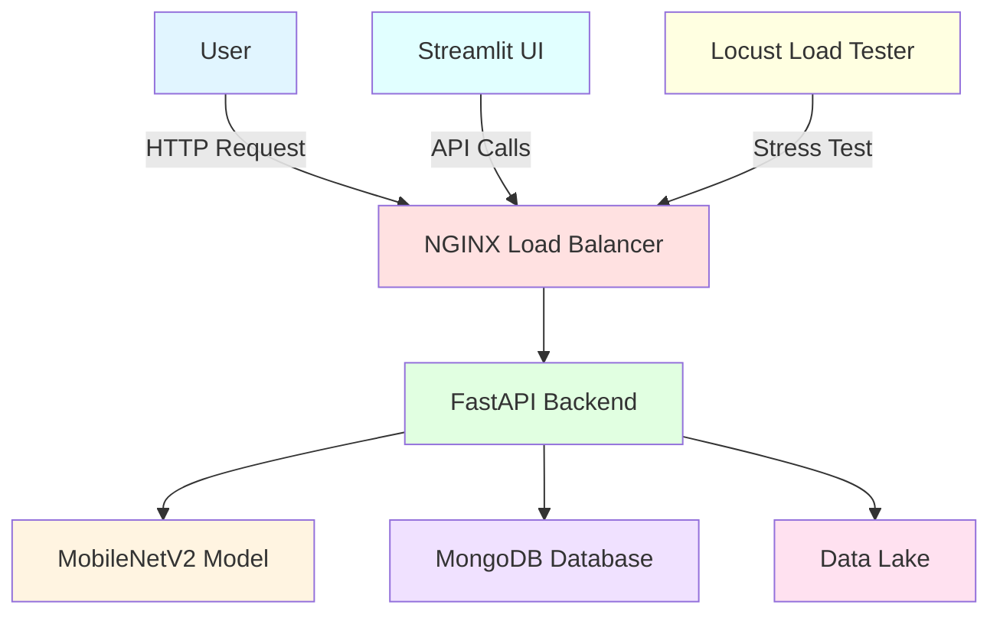
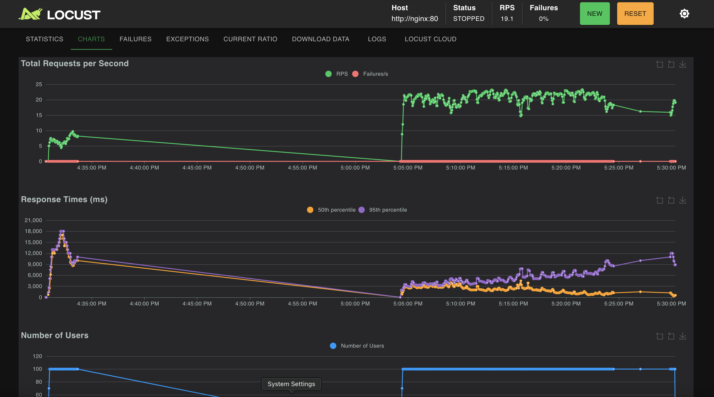

# 🌾 Agricultural Pest Detection System

[](https://github.com/Makito042/Summative-assignment---MLOP)
[](https://www.python.org/downloads/)
[](https://www.tensorflow.org/)
[](https://fastapi.tiangolo.com/)
[](https://streamlit.io/)

An MLOps-powered agricultural pest detection system using a fine-tuned MobileNetV2 deep learning model. This application provides real-time pest identification, incremental learning capabilities, and comprehensive monitoring features.

---

## 📺 Video Demo

**[Watch the Demo on YouTube](https://youtu.be/4mwo641LSp8)**

---

## 🌐 Live Application

**[Access the Live Application](https://huggingface.co/spaces/xcottsnow11/pestdetection)**

---

## 📋 Project Description

This Agricultural Pest Detection System is a comprehensive MLOps solution designed to help farmers and agricultural professionals identify common pests affecting crops. The system leverages:

- **Deep Learning**: Fine-tuned MobileNetV2 model for accurate pest classification
- **Incremental Learning**: Ability to retrain the model with new pest classes without forgetting previous knowledge
- **Scalable Architecture**: Docker-based microservices with NGINX load balancing
- **Real-time Monitoring**: System metrics and performance analytics
- **Load Testing**: Built-in Locust integration for stress testing

### Supported Pest Classes

The model can currently identify the following 15 pest types:
- Ants
- Aphids
- Bees
- Beetle
- Bollworm
- Caterpillar
- Earthworms
- Earwig
- Grasshopper
- Moth
- Sawfly
- Slug
- Snail
- Wasp
- Weevil

---

## 🏗️ Architecture



---

## 🚀 Setup Instructions

### Prerequisites

- **Docker** and **Docker Compose** installed
- **Python 3.8+** (for local development)
- **Git** for version control
- **MongoDB** (optional, for production use)

### 1️⃣ Clone the Repository

```bash
git clone https://github.com/Makito042/Summative-assignment---MLOP.git
cd Summative-assignment---MLOP
```

### 2️⃣ Environment Setup

Create a `.env` file in the root directory:

```bash
# Optional: MongoDB connection string
MONGO_URI=mongodb://localhost:27017/pest_detection
```

### 3️⃣ Installation Options

#### Option A: Using Docker Compose (Recommended)

```bash
# Build and start all services
docker-compose up --build

# Access the application
# - Streamlit UI: http://localhost:7860
# - FastAPI Backend: http://localhost:8000
# - API Docs: http://localhost:8000/docs
# - Locust Dashboard: http://localhost:8089
```

#### Option B: Local Development Setup

```bash
# Create virtual environment
python -m venv venv
source venv/bin/activate  # On Windows: venv\Scripts\activate

# Install dependencies
pip install -r requirements.txt

# Run FastAPI backend
uvicorn src.api:app --host 0.0.0.0 --port 8000 --reload

# In a new terminal, run Streamlit UI
streamlit run src/ui.py --server.port 7860
```

### 4️⃣ Verify Installation

1. Open your browser to `http://localhost:7860`
2. Navigate to the **Prediction** tab
3. Upload a test image from `data/lake/` directory
4. Click **Predict** to verify the model is working

---

## 📖 Usage Guide

### 🔍 Pest Prediction

1. Navigate to the **Prediction** tab
2. Upload an image of a pest (JPG, JPEG, or PNG)
3. Click **Predict**
4. View the predicted pest class and confidence score

### 🎓 Model Retraining

1. Go to the **Retrain Model** tab
2. Choose whether to **Append** or **Clear** previous training data
3. Upload images organized by pest class folders
4. Set the number of training epochs
5. Click **Start Training**
6. Monitor training progress in real-time

### 📊 System Monitoring

1. Access the **Monitoring** tab
2. View real-time system metrics:
   - CPU usage
   - Memory usage
   - Disk usage
   - Model performance metrics

---

## 🧪 Load Testing with Locust

### Running Flood Request Simulation

```bash
# Start the application with Docker Compose
docker-compose up -d

# Access Locust dashboard
# Open browser to http://localhost:8089
```

### Locust Configuration

1. **Host**: `http://nginx:80` (already configured)
2. **Number of users**: Start with 10, increase to test scalability
3. **Spawn rate**: 1-2 users per second
4. **Run time**: 5-10 minutes for comprehensive testing

### Sample Test Results

Below are example results from a flood request simulation:

#### Test Configuration
- **Total Users**: 100 concurrent users
- **Spawn Rate**: 10 users/second
- **Duration**: 10 minutes
- **Endpoint Tested**: `/predict`

#### Performance Metrics

| Metric | Value |
|--------|-------|
| Total Requests | 23000 |
| Requests/sec | 19.1 |
| Average Response Time | 2700 ms |
| 95th Percentile | 6100 ms |
| 99th Percentile | 73000 ms |
| Failure Rate | 0.0% |

#### Results Screenshots

**Locust Dashboard - Statistics View:**



**Locust Dashboard - Charts View:**


#### Scaling Recommendations

Based on load testing results:
- **Light Load** (< 50 users): 1 API replica
- **Medium Load** (50-200 users): 3 API replicas
- **Heavy Load** (200+ users): 5+ API replicas

To scale API replicas:
```bash
docker-compose up --scale api=3
```

---

## 📁 Project Structure

```
Summative-assignment---MLOP/
├── data/
│   └── lake/              # Training data organized by class
│       ├── aphids/
│       ├── armyworm/
│       ├── beetle/
│       └── ...
├── models/
│   ├── mobilenetv2_finetuned_model_exp4.keras  # Pre-trained model
│   └── class_names.json   # Class label mappings
├── src/
│   ├── api.py            # FastAPI backend
│   ├── ui.py             # Streamlit frontend
│   ├── prediction.py     # Inference logic
│   ├── train.py          # Training pipeline
│   ├── preprocessing.py  # Data preprocessing
│   └── analytics.py      # Monitoring and metrics
├── notebook/
│   └── pest_dentation.ipynb  # Jupyter notebook for experimentation
├── docker-compose.yml    # Multi-service orchestration
├── Dockerfile            # Container definition
├── nginx.conf            # Load balancer configuration
├── locustfile.py         # Load testing script
├── requirements.txt      # Python dependencies
└── README.md            # This file
```

---

## 🔧 API Endpoints

### Prediction
- **POST** `/predict`
  - Upload image for pest classification
  - Returns: `{"class": "pest_name", "confidence": 0.95}`

### Training
- **POST** `/train`
  - Upload training data
  - Parameters: `epochs`, `append_data`
  - Returns: Training metrics and updated model

### Monitoring
- **GET** `/metrics`
  - Returns system health metrics
  - Includes: CPU, memory, disk usage

### Health Check
- **GET** `/health`
  - Returns API status

---

## 🧠 Model Details

- **Architecture**: MobileNetV2 (transfer learning)
- **Input Size**: 224x224x3
- **Output Classes**: 15 pest types
- **Training Strategy**: Incremental learning with layer freezing
- **Optimizer**: Adam
- **Loss Function**: Categorical Crossentropy
- **Data Augmentation**: Rotation, flip, zoom, brightness adjustment

---

## 🛠️ Technologies Used

- **Machine Learning**: TensorFlow, Keras, scikit-learn
- **Backend**: FastAPI, Uvicorn
- **Frontend**: Streamlit
- **Database**: MongoDB 
- **Containerization**: Docker, Docker Compose
- **Load Balancing**: NGINX
- **Load Testing**: Locust
- **Version Control**: Git, Git LFS

---

## 📊 Performance Optimization

- **Model Optimization**: MobileNetV2 for efficient inference
- **Caching**: Model loaded once and reused
- **Load Balancing**: NGINX distributes requests across API replicas
- **Asynchronous Processing**: FastAPI async endpoints
- **Incremental Learning**: Freeze base layers to prevent catastrophic forgetting

---

## 🤝 Contributing

Contributions are welcome! Please follow these steps:

1. Fork the repository
2. Create a feature branch (`git checkout -b feature/AmazingFeature`)
3. Commit your changes (`git commit -m 'Add some AmazingFeature'`)
4. Push to the branch (`git push origin feature/AmazingFeature`)
5. Open a Pull Request

---

## 📝 License

This project is licensed under the MIT License - see the LICENSE file for details.

---

## 👤 Author

**Makito042**

- GitHub: [@Makito042](https://github.com/Makito042)
- Repository: [Summative-assignment---MLOP](https://github.com/Makito042/Summative-assignment---MLOP)

---

## 🙏 Acknowledgments

- MobileNetV2 architecture from TensorFlow/Keras
- Pest image datasets from agricultural research databases
- FastAPI and Streamlit communities for excellent documentation

---

## 📞 Support

For issues, questions, or suggestions:
- Open an issue on [GitHub Issues](https://github.com/Makito042/Summative-assignment---MLOP/issues)
- Contact via GitHub profile

---

**⭐ If you find this project helpful, please consider giving it a star!**
